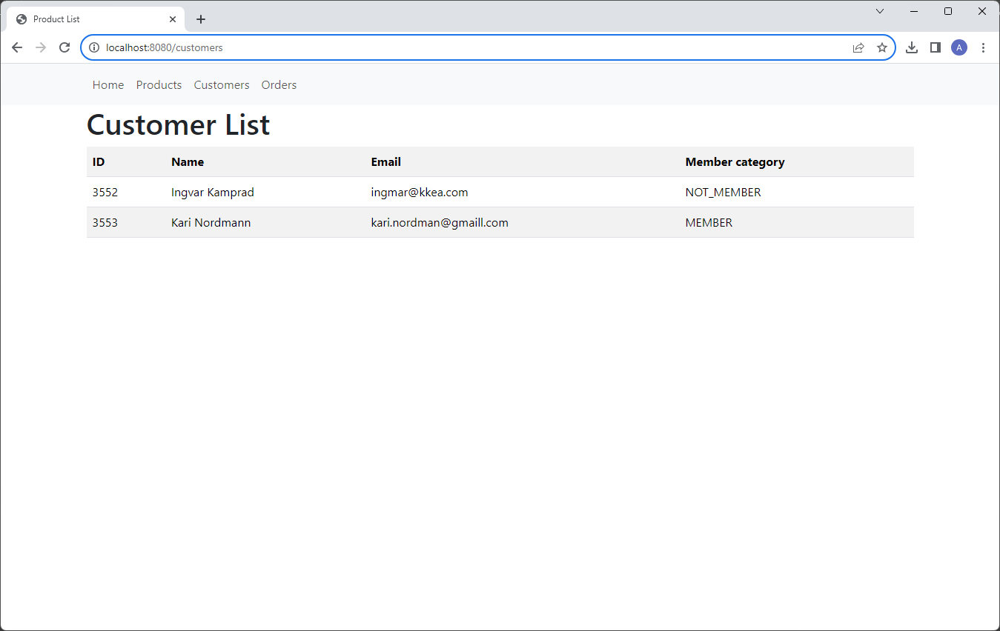
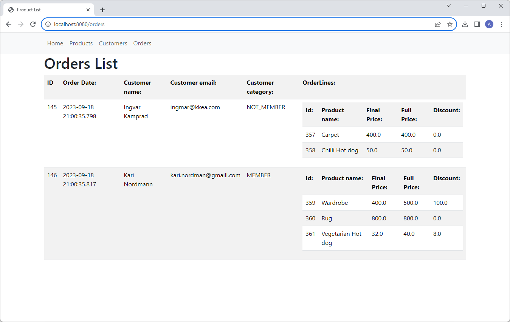
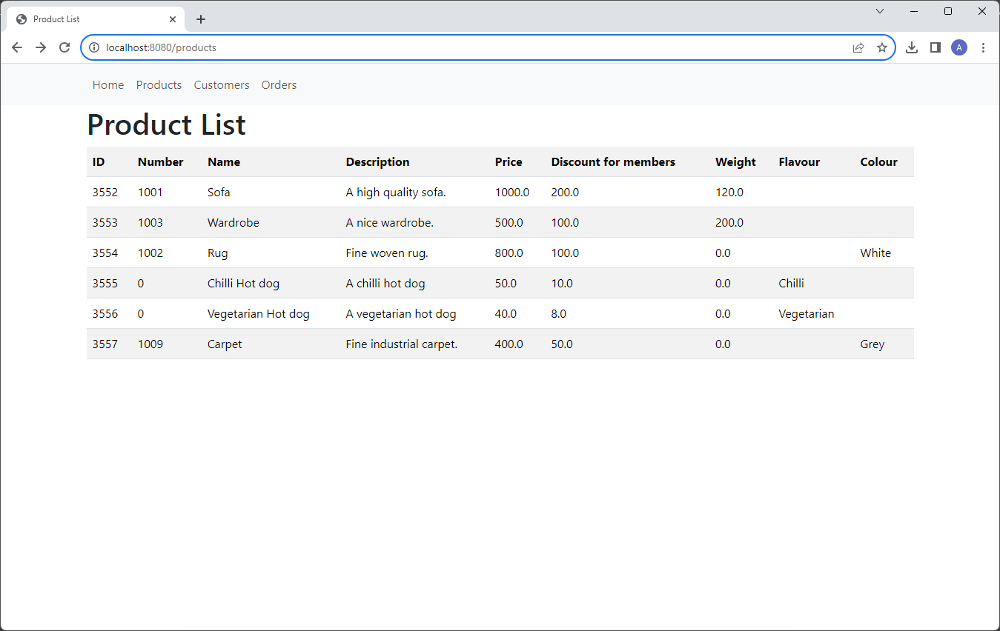
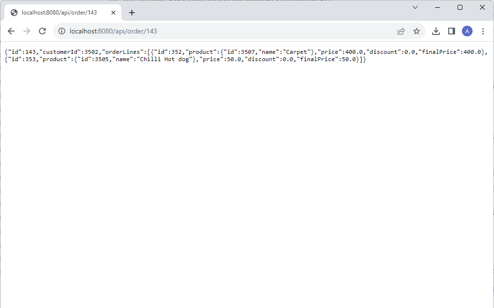

The Web System
===================================

A Java Spring boot application.  
MySQL database.  
Compile with Maven.  
Requires Java 17, because of Spring Boot 3.1.3.

Web usage
========= 
Start the application and open the application here:
http://localhost:8080/

Screenshots
===========
Customers:

Orders:

Products:

API usage
=========

Create order:
http://localhost:8080/api/createOrder?customerId=3452&productIds=3452

Get order:
http://localhost:8080/api/order/143

API:

